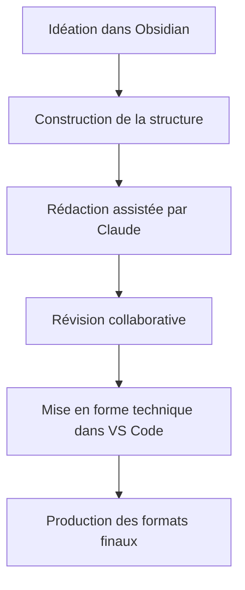

# PROJECT KNOWLEDGE: GUIDE COMPLET

## Édition littéraire assistée par Claude avec Obsidian & VS Code

  

---

  

## Table des matières

- [DIRECTIVE D'UTILISATION](#directive-dutilisation)

  - [Système de navigation par références](#système-de-navigation-par-références)

  - [Guide d'implémentation dans Obsidian](#guide-dimplémentation-dans-obsidian)

- [1. VUE D'ENSEMBLE DU WORKFLOW](#1-vue-densemble-du-workflow)

  - [Avantages clés de ce workflow](#avantages-clés-de-ce-workflow)

- [2. PRÉPARATION DE L'ENVIRONNEMENT](#2-préparation-de-lenvironnement)

  - [Installation des outils](#installation-des-outils)

  - [Configuration du dépôt Git](#configuration-du-dépôt-git)

- [3. STRUCTURE DU PROJECT KNOWLEDGE](#3-structure-du-project-knowledge)

  - [Organisation des fichiers](#organisation-des-fichiers)

  - [Document index](#document-index)

- [4. UTILISATION DE CLAUDE](#4-utilisation-de-claude)

  - [Organisation en projets Claude](#organisation-en-projets-claude)

  - [Importation de documents GitHub](#importation-de-documents-github)

  - [Initialisation du projet](#initialisation-du-projet)

  - [Sessions de brainstorming](#sessions-de-brainstorming)

  - [Gestion des limitations de session](#gestion-des-limitations-de-session)

  - [Révision de contenu](#révision-de-contenu)

  - [Stockage des interactions](#stockage-des-interactions)

- [5. WORKFLOW OBSIDIAN](#5-workflow-obsidian)

  - [Création de la structure](#création-de-la-structure)

  - [Gestion des personnages et éléments](#gestion-des-personnages-et-éléments)

  - [Navigation par graphe](#navigation-par-graphe)

- [6. INTÉGRATION VS CODE](#6-intégration-vs-code)

  - [Configuration optimale](#configuration-optimale)

  - [Scripts d'automatisation](#scripts-dautomatisation)

  - [Options multiplateforme](#options-multiplateforme)

- [6.1 GESTION DE LA TYPOGRAPHIE](#61-gestion-de-la-typographie)

  - [Typographie française avancée](#typographie-française-avancée)

  - [Outils de vérification typographique](#outils-de-vérification-typographique)

  - [Interface utilisateur pour la correction](#interface-utilisateur-pour-la-correction)

  - [Standards spécifiques par genre](#standards-spécifiques-par-genre)

- [7. GÉNÉRATION DES FORMATS FINAUX](#7-génération-des-formats-finaux)

  - [HTML et site web](#html-et-site-web)

  - [PDF de qualité édition](#pdf-de-qualité-édition)

  - [Format EPUB](#format-epub)

- [8. BONNES PRATIQUES](#8-bonnes-pratiques)

  - [Versionnement](#versionnement)

  - [Sauvegarde](#sauvegarde)

  - [Collaboration](#collaboration)

- [9. RESSOURCES COMPLÉMENTAIRES](#9-ressources-complémentaires)

  - [Tutoriels recommandés](#tutoriels-recommandés)

  - [Extensions et plugins utiles](#extensions-et-plugins-utiles)

  - [Bonnes pratiques avec Claude](#bonnes-pratiques-avec-claude)

- [SCRIPT DE CONVERSION](#script-de-conversion)

- [FIN DU GUIDE](#fin-du-guide)

  

---

  

## DIRECTIVE D'UTILISATION

  

Ce guide documente un workflow d'édition littéraire assisté par IA combinant Claude, Obsidian et VS Code. Il est conçu pour les auteurs et éditeurs habitués aux outils traditionnels (Word, etc.) souhaitant adopter un environnement de travail plus puissant.

  

### Système de navigation par références

  

Ce document utilise deux systèmes de référence complémentaires :

  

1. **Système théorique de taxonomie** (pour la documentation et la conceptualisation) :

   ```

   @[NomDuConcept](TypeDeRéférence:IdentifiantSection)

   ```

   Ce système permet de documenter précisément les relations conceptuelles entre les éléments.

  

2. **Liens Obsidian pratiques** (pour l'implémentation réelle dans Obsidian) :

   ```

   [[NomDuFichier]] #Tag1 #Tag2

   ```

   Ces liens fonctionnent nativement dans Obsidian et permettent la navigation.

  

**Types de références:**

* Workflow (W) - Étapes du processus d'édition

* Outil (O) - Logiciels et interfaces

* Technique (T) - Méthodes spécifiques d'édition

* Structure (S) - Éléments d'organisation du contenu

* Format (F) - Types de fichiers et formats de sortie

* Pratique (P) - Bonnes pratiques recommandées

* IA (I) - Utilisation spécifique de Claude

* Référence (R) - Ressources supplémentaires

  

### Guide d'implémentation dans Obsidian

  

Pour traduire le système théorique en pratique dans Obsidian, suivez ces recommandations :

  

1. **Structure de dossiers** : Créez un dossier pour chaque type de référence :

   ```

   Projet/

   ├── Workflow/

   ├── Outil/

   ├── Technique/

   ├── Structure/

   ├── Format/

   ├── Pratique/

   ├── IA/

   └── Référence/

   ```

  

2. **Nommage des fichiers** : Utilisez l'identifiant comme préfixe, suivi du nom du concept :

   ```

   IA/CLAUDE00-ProjetsClaude.md

   ```

  

3. **Tags** : Appliquez systématiquement des tags correspondant aux types de référence :

   ```

   #IA #Outil #Workflow

   ```

  

4. **Référence croisée** : Pour référencer un concept dans le texte, utilisez les liens wiki d'Obsidian :

   ```

   [[IA/CLAUDE00-ProjetsClaude|ProjetsClaude]]

   ```

  

5. **Propriétés YAML** : En haut de chaque note, ajoutez des métadonnées pour faciliter les requêtes avec le plugin Dataview :

   ```yaml

   ---

   type: IA

   id: CLAUDE00

   nom: ProjetsClaude

   ---

   ```

  

---

  

## 1. VUE D'ENSEMBLE DU WORKFLOW

  

Notre workflow d'édition littéraire combine trois outils principaux:

  

1. **Claude** @[Claude](O:IA01) - Assistant IA pour la révision, l'amélioration et la génération de contenu

2. **Obsidian** @[Obsidian](O:ED01) - Pour l'idéation, l'organisation conceptuelle et la structure

3. **VS Code** @[VSCode](O:ED02) - Pour le travail technique et les intégrations

  

> **Implémentation dans Obsidian :**

> - [[Outil/IA01-Claude|Claude]] #Outil #IA

> - [[Outil/ED01-Obsidian|Obsidian]] #Outil

> - [[Outil/ED02-VSCode|VSCode]] #Outil

  

Le flux de travail se décompose en 6 phases principales:

  



  

### Avantages clés de ce workflow

- Organisation non-linéaire des idées

- Versionnement robuste avec Git

- Assistance IA personnalisée

- Séparation contenu/mise en forme

- Génération automatisée de multiples formats de sortie

  

---

  

## 2. PRÉPARATION DE L'ENVIRONNEMENT

  

### Installation des outils @[Installation](W:PREP01)

  

1. **Claude**

   - Accédez à [claude.ai](https://claude.ai)

   - Créez un compte si nécessaire

  

2. **Obsidian**

   - Téléchargez depuis [obsidian.md](https://obsidian.md)

   - Installez les plugins recommandés:

     * Outliner

     * Kanban

     * Templates

     * Tag Pane

     * Obsidian Git

  

3. **VS Code**

   - Téléchargez depuis [code.visualstudio.com](https://code.visualstudio.com)

   - Installez les extensions recommandées:

     * Markdown All in One

     * Markdown Preview Enhanced

     * GitLens

     * Paste Image

  

> **Implémentation dans Obsidian :**

> [[Workflow/PREP01-Installation|Installation]] #Workflow

  

### Configuration du dépôt Git @[GitSetup](W:PREP02)

  

1. Créez un nouveau dépôt Git local:

   ```bash

   mkdir mon-projet-litteraire

   cd mon-projet-litteraire

   git init

   ```

  

2. Configurez Obsidian pour utiliser ce dossier comme coffre (vault)

  

3. Installez et configurez le plugin Obsidian Git:

   - Intervalle de sauvegarde: 10 minutes

   - Messages de commit automatiques

  

> **Implémentation dans Obsidian :**

> [[Workflow/PREP02-GitSetup|Configuration Git]] #Workflow

  

---

  

## 3. STRUCTURE DU PROJECT KNOWLEDGE

  

### Organisation des fichiers @[Structure](S:ORG01)

  

```

mon-projet-litteraire/

├── index.md                # Document principal

├── structure/              # Plan et structure

├── chapitres/              # Contenu principal

├── ressources/             # Recherches et références

├── media/                  # Images et autres médias

├── templates/              # Modèles de documents

└── export/                 # Fichiers générés

```

  

> **Implémentation dans Obsidian :**

> [[Structure/ORG01-Structure|Organisation des fichiers]] #Structure

  

### Document index @[IndexDoc](S:ORG02)

  

Le fichier `index.md` sert de point d'entrée et contient:

- Métadonnées du projet

- Liens vers les sections principales

- État d'avancement

- Notes éditoriales générales

  

Exemple:

```markdown

# Mon Projet Littéraire

  

## Métadonnées

- Titre: [Titre de l'œuvre]

- Auteur: [Votre nom]

- Genre: [Genre littéraire]

- Statut: #en-cours

  

## Structure

- [[structure/plan-general]]

- [[structure/personnages]]

- [[structure/univers]]

  

## Chapitres

- [[chapitres/chapitre-01]]

- [[chapitres/chapitre-02]]

...

```

  

> **Implémentation dans Obsidian :**

> [[Structure/ORG02-IndexDoc|Document index]] #Structure

  

---

  

## 4. UTILISATION DE CLAUDE

  

### Organisation en projets Claude @[ProjetsClaude](I:CLAUDE00)

  

Structurez votre travail efficacement sur Claude:

  

1. Créez des projets distincts pour:

   - Développement narratif global

   - Travail sur les personnages

   - Révision stylistique

   - Recherche thématique

  

2. Avantages de l'organisation en projets:

   - Contexte préservé entre les sessions

   - Historique des conversations accessible

   - Séparation claire des différentes dimensions du travail

   - Facilite le partage avec des collaborateurs

  

3. Nommez clairement vos projets pour faciliter la navigation:

   ```

   [Titre du livre] - Développement narratif

   [Titre du livre] - Personnages

   [Titre du livre] - Révision

   ```

  

> **Implémentation dans Obsidian :**

> [[IA/CLAUDE00-ProjetsClaude|Organisation en projets Claude]] #IA

  

### Importation de documents GitHub @[ImportGitHub](I:CLAUDE01)

  

Claude peut importer directement des documents depuis GitHub:

  

1. Avantages:

   - Partage de documents volumineux

   - Conservation de la mise en forme

   - Travail sur des versions spécifiques

   - Analyse de sections entières

  

2. Comment importer:

   - Utilisez la fonction d'upload de document dans l'interface Claude

   - Partagez des liens directs vers les fichiers raw de GitHub

   - Demandez à Claude d'analyser des sections spécifiques

  

3. Bonnes pratiques:

   - Fragmentez les documents volumineux en sections logiques

   - Utilisez des commentaires dans les fichiers pour guider Claude

   - Référez-vous à des lignes ou sections spécifiques dans vos prompts

  

> **Implémentation dans Obsidian :**

> [[IA/CLAUDE01-ImportGitHub|Importation de documents GitHub]] #IA

  

### Initialisation du projet @[InitProjet](I:CLAUDE02)

  

Pour initialiser Claude avec votre projet:

  

1. Créez une session de chat dédiée

2. Présentez le concept général et le genre littéraire

3. Définissez le ton et le style souhaités

4. Établissez une terminologie spécifique

  

Exemple de prompt initial:

```

Je travaille sur un roman [genre] intitulé "[titre]".

Le concept central est [concept].

Les personnages principaux sont [personnages].

J'aimerais que tu m'aides avec le développement de l'intrigue,

la cohérence des personnages et le style d'écriture,

qui devrait être [caractéristiques du style].

```

  

> **Implémentation dans Obsidian :**

> [[IA/CLAUDE02-InitProjet|Initialisation du projet avec Claude]] #IA

  

### Sessions de brainstorming @[Brainstorming](I:CLAUDE03)

  

Utilisez Claude pour explorer de nouvelles idées:

  

1. Décrivez un élément spécifique (personnage, scène, concept)

2. Demandez des variations ou développements

3. Enregistrez les idées pertinentes dans Obsidian

  

Exemple:

```

Peux-tu m'aider à développer le personnage de [nom]?

Voici ce que j'ai déjà: [description existante].

J'aimerais explorer ses motivations et son arc narratif.

```

  

> **Implémentation dans Obsidian :**

> [[IA/CLAUDE03-Brainstorming|Sessions de brainstorming avec Claude]] #IA

  

### Gestion des limitations de session @[LimiteSessions](I:CLAUDE04)

  

Optimisez l'utilisation de Claude malgré les limitations:

  

1. **Contraintes actuelles**:

   - Limite de taille par message

   - Limite d'échanges par période

   - Historique limité par conversation

  

2. **Stratégies d'optimisation**:

   - Divisez les longs textes en segments thématiques

   - Utilisez des liens GitHub pour partager de longs documents

   - Résumez les conversations précédentes dans les nouveaux prompts

   - Exportez régulièrement les conversations importantes

  

3. **Préparation du contexte**:

   - Créez des résumés à jour de votre projet

   - Préparez des "fiches contextuelles" réutilisables

   - Indiquez clairement où vous en étiez lors de la dernière session

  

> **Implémentation dans Obsidian :**

> [[IA/CLAUDE04-LimiteSessions|Gestion des limitations de session]] #IA

  

### Révision de contenu @[Revision](I:CLAUDE05)

  

Pour soumettre du contenu à révision:

  

1. Copiez le texte depuis Obsidian ou importez depuis GitHub

2. Spécifiez clairement vos demandes de révision

3. Intégrez les suggestions pertinentes dans votre document

  

Exemple:

```

Voici un extrait du chapitre 3:

  

[Votre texte]

  

J'aimerais que tu:

1. Améliores la fluidité des dialogues

2. Vérifies la cohérence avec les événements du chapitre 2

3. Renforces la caractérisation du personnage principal

```

  

> **Implémentation dans Obsidian :**

> [[IA/CLAUDE05-Revision|Révision de contenu avec Claude]] #IA

  

### Stockage des interactions @[SessionsLog](I:CLAUDE06)

  

Documenter vos sessions avec Claude:

  

1. Créez un dossier `claude-sessions/` dans votre projet

2. Pour chaque session importante, créez un fichier Markdown

3. Incluez le contexte, les prompts et les réponses clés

  

> **Implémentation dans Obsidian :**

> [[IA/CLAUDE06-SessionsLog|Stockage des interactions avec Claude]] #IA

  

---

  

## 5. WORKFLOW OBSIDIAN

  

### Création de la structure @[StructureCreation](W:OBS01)

  

Utilisez Obsidian pour établir la structure principale:

  

1. Créez un fichier `structure/plan-general.md`

2. Utilisez des titres et sous-titres pour établir la hiérarchie

3. Créez des liens vers des fichiers détaillés pour chaque section

  

> **Implémentation dans Obsidian :**

> [[Workflow/OBS01-StructureCreation|Création de la structure]] #Workflow

  

### Gestion des personnages et éléments @[ElementsGestion](W:OBS02)

  

Créez des fiches détaillées:

  

1. Un fichier par personnage/élément important

2. Utilisez des templates standardisés

3. Créez des liens bidirectionnels entre éléments connexes

  

Exemple de template personnage:

```markdown

# {{nom}}

  

## Caractéristiques

- Âge:

- Apparence:

- Traits de caractère:

  

## Contexte

- Origine:

- Famille:

- Occupation:

  

## Arc narratif

- Motivation:

- Conflit:

- Évolution:

  

## Apparitions

- [[chapitres/chapitre-où-le-personnage-apparaît]]

  

## Notes

```

  

> **Implémentation dans Obsidian :**

> [[Workflow/OBS02-ElementsGestion|Gestion des personnages et éléments]] #Workflow

  

### Navigation par graphe @[GraphView](T:OBS03)

  

Exploitez la vue graphique d'Obsidian:

  

1. Activez la vue graphe (icône de nœuds dans la barre latérale)

2. Filtrez par tags pour visualiser des aspects spécifiques

3. Identifiez les connexions non évidentes entre éléments

  

> **Implémentation dans Obsidian :**

> [[Technique/OBS03-GraphView|Navigation par graphe]] #Technique

  

---

  

## 6. INTÉGRATION VS CODE

  

### Configuration optimale @[VSCodeSetup](O:VSC01)

  

Configurez VS Code pour le travail d'édition littéraire:

  

```json

{

  "markdown.extension.toc.updateOnSave": true,

  "markdown.extension.preview.autoShowPreviewToSide": true,

  "editor.wordWrap": "on",

  "editor.lineHeight": 24

}

```

  

> **Implémentation dans Obsidian :**

> [[Outil/VSC01-VSCodeSetup|Configuration optimale de VS Code]] #Outil

  

### Scripts d'automatisation @[Scripts](T:VSC02)

  

Développez des scripts Python pour automatiser certaines tâches:

  

1. Création d'un script d'assemblage:

```python

# compile.py

# Script qui assemble tous les fichiers Markdown selon la structure

import os

import re

  

def compile_document(index_file, output_file):

    # Logique d'assemblage

    pass

```

  

2. Script d'extraction pour Claude:

```python

# extract_for_claude.py

# Extrait une section pour révision avec Claude

import sys

  

def extract_section(file_path, section_name):

    # Logique d'extraction

    pass

```

  

> **Implémentation dans Obsidian :**

> [[Technique/VSC02-Scripts|Scripts d'automatisation pour VS Code]] #Technique

  

### Options multiplateforme @[Multiplateforme](T:VSC03)

  

Pour accommoder les utilisateurs de différents environnements:

  

1. **Interface graphique simple**:

   - Créez un script Python avec interface Tkinter:

   ```python

   import tkinter as tk

   from tkinter import filedialog

   def create_simple_gui():

       root = tk.Tk()

       root.title("Outils d'édition")

       # Ajoutez des boutons pour les fonctions courantes

       # Exemple: assembler, vérifier, exporter

   ```

  

2. **Utilisateurs Windows (CMD)**:

   - Créez des fichiers batch (.bat) équivalents:

   ```batch

   @echo off

   REM compile.bat

   python compile.py %1 %2

   ```

  

3. **Interface web GitHub**:

   - Ajoutez des Actions GitHub dans `.github/workflows/`:

   ```yaml

   name: Compiler Document

   on: [push]

   jobs:

     build:

       runs-on: ubuntu-latest

       steps:

         - uses: actions/checkout@v2

         - name: Set up Python

           uses: actions/setup-python@v2

         - name: Compiler

           run: python compile.py

   ```

  

> **Implémentation dans Obsidian :**

> [[Technique/VSC03-Multiplateforme|Options multiplateforme]] #Technique

  

---

  

## 6.1 GESTION DE LA TYPOGRAPHIE @[Typographie](W:TYP01)

  

### Typographie française avancée @[TypoFR](T:TYP02)

  

La typographie française comporte des règles spécifiques à respecter:

  

1. **Espaces insécables**:

   - Avant les signes doubles (:, ?, !, ;)

   - Après l'ouverture et avant la fermeture des guillemets français (« »)

   - Dans les nombres pour séparer les milliers

  

2. **Guillemets**:

   - Utilisation des guillemets français (« ») pour les citations principales

   - Guillemets anglais (" ") pour les citations à l'intérieur d'autres citations

  

3. **Tirets**:

   - Tiret cadratin (—) pour les dialogues

   - Tiret demi-cadratin (–) pour les incises

  

> **Implémentation dans Obsidian :**

> [[Technique/TYP02-TypoFR|Typographie française avancée]] #Technique

  

### Outils de vérification typographique @[OutilsTypo](T:TYP03)

  

1. **Grammarleck** (Python):

   ```python

   # typo_check.py

   import grammalecte

   def check_typography(text_file):

       with open(text_file, 'r', encoding='utf-8') as f:

           text = f.read()

       gc = grammalecte.GrammarChecker("fr")

       result = gc.correct(text)

       return result

   ```

  

2. **Adaptation aux standards d'édition**:

   Créez un fichier de configuration pour respecter le style d'une maison d'édition:

   ```json

   {

     "typographie": {

       "guillemets": "français",

       "dialogues": "cadratin",

       "citation_imbriquée": "anglais",

       "espaces_insécables": true

     }

   }

   ```

  

3. **Script de correction automatique**:

   ```python

   # auto_typography.py

   import re

   def fix_french_typography(text):

       # Remplace les guillemets droits par des guillemets français

       text = re.sub(r'"([^"]*)"', r'« \1 »', text)

       # Ajoute des espaces insécables

       text = re.sub(r'([?!:;])', r' \1', text)

       # Corrige les dialogues

       text = re.sub(r'- ', r'— ', text)

       return text

   ```

  

> **Implémentation dans Obsidian :**

> [[Technique/TYP03-OutilsTypo|Outils de vérification typographique]] #Technique

  

### Interface utilisateur pour la correction @[InterfaceTypo](T:TYP04)

  

Pour les utilisateurs moins techniques:

  

1. **Extension VS Code**:

   - Créez une extension simple avec des boutons pour appliquer les règles

   - Ajoutez une prévisualisation en temps réel des corrections

  

2. **Interface web simple**:

   - Formulaire HTML permettant de coller du texte et d'obtenir une version corrigée

   - Déployable sur GitHub Pages

  

3. **Intégration avec Obsidian**:

   - Créez un plugin personnalisé

   - Ajoutez des commandes accessibles dans la palette d'Obsidian

  

> **Implémentation dans Obsidian :**

> [[Technique/TYP04-InterfaceTypo|Interface utilisateur pour la correction]] #Technique

  

### Standards spécifiques par genre @[GenreTypo](T:TYP05)

  

Configurez des préréglages pour différents genres littéraires:

  

1. **Roman littéraire**:

   - Guillemets français

   - Dialogues avec tiret cadratin et retour à la ligne

  

2. **Poésie**:

   - Préservation des espaces en début de ligne

   - Traitement spécial des enjambements

  

3. **Documentation technique**:

   - Format de référence ISO

   - Espacement spécifique pour les listes

  

4. **Livres académiques**:

   - Format de citation standardisé (APA, MLA, Chicago)

   - Gestion des notes de bas de page

  

> **Implémentation dans Obsidian :**

> [[Technique/TYP05-GenreTypo|Standards typographiques par genre]] #Technique

  

---

  

## 7. GÉNÉRATION DES FORMATS FINAUX @[Export](W:EXP01)

  

Utilisez VS Code pour générer les formats de sortie:

  

### HTML et site web

  

1. Installez l'extension "Markdown PDF" dans VS Code

2. Configurez les options d'export HTML

3. Exportez chaque chapitre ou le document assemblé

  

### PDF de qualité édition

  

1. Utilisez Pandoc via terminal:

```bash

pandoc -s document.md -o document.pdf --pdf-engine=xelatex --template=template.tex

```

  

2. Personnalisez les styles avec un fichier template.tex

  

### Format EPUB

  

1. Utilisez Pandoc pour générer l'EPUB:

```bash

pandoc -s document.md -o document.epub --epub-cover-image=cover.jpg

```

  

2. Validez le format avec EpubCheck

  

> **Implémentation dans Obsidian :**

> [[Workflow/EXP01-Export|Génération des formats finaux]] #Workflow

  

---

  

## 8. BONNES PRATIQUES

  

### Versionnement @[Versionnement](P:GIT01)

  

1. Committez fréquemment avec des messages descriptifs

2. Créez des branches pour les révisions majeures

3. Utilisez des tags Git pour marquer les versions importantes:

```bash

git tag -a v0.1 -m "Premier jet complet"

```

  

> **Implémentation dans Obsidian :**

> [[Pratique/GIT01-Versionnement|Bonnes pratiques de versionnement]] #Pratique

  

### Sauvegarde @[Sauvegarde](P:SEC01)

  

1. Configurez un dépôt Git distant (GitHub, GitLab)

2. Poussez régulièrement vos modifications

3. Envisagez des sauvegardes supplémentaires hors Git

  

> **Implémentation dans Obsidian :**

> [[Pratique/SEC01-Sauvegarde|Stratégies de sauvegarde]] #Pratique

  

### Collaboration @[Collaboration](P:COLLAB01)

  

Pour travailler à plusieurs:

  

1. Établissez des conventions de nommage claires

2. Assignez des sections distinctes à chaque collaborateur

3. Utilisez des Pull Requests pour les fusions importantes

4. Planifiez des sessions de révision communes

  

> **Implémentation dans Obsidian :**

> [[Pratique/COLLAB01-Collaboration|Méthodes de collaboration]] #Pratique

  

---

  

## 9. RESSOURCES COMPLÉMENTAIRES

  

### Tutoriels recommandés @[Tutoriels](R:TUT01)

- [Guide officiel Obsidian](https://help.obsidian.md)

- [Markdown Guide](https://www.markdownguide.org)

- [Utilisation avancée de Git](https://git-scm.com/book)

  

> **Implémentation dans Obsidian :**

> [[Référence/TUT01-Tutoriels|Tutoriels recommandés]] #Référence

  

### Extensions et plugins utiles @[Extensions](R:EXT01)

- Obsidian: Dataview, Admonition

- VS Code: Code Spell Checker, Word Count

  

> **Implémentation dans Obsidian :**

> [[Référence/EXT01-Extensions|Extensions et plugins utiles]] #Référence

  

### Bonnes pratiques avec Claude @[ClaudeBestPractices](I:CLAUDE07)

  

#### Nomenclature correcte

1. **Utilisation du nom**: L'assistant s'appelle simplement "Claude" et non "Claude.ai". Le ".ai" fait référence au domaine du site web (claude.ai), mais n'est pas inclus dans le nom du produit.

  

2. **Références cohérentes**: Utilisez toujours "Claude" de manière cohérente dans tous vos documents et communications pour éviter la confusion.

  

#### Utilisation des liens dans les documents

1. **Liens relatifs uniquement**: Évitez d'inclure des liens absolus vers des conversations Claude dans vos documents destinés à être partagés. Ces liens ne fonctionneront pas pour les autres utilisateurs.

   ```markdown

   # À éviter

   [[https://claude.ai/chat/f9fb33fd-e95d-4a5f-838c-ccc1c60df751]]

   # Préférez cette approche

   [[IA/CLAUDE01-ImportGitHub|ImportGitHub]] #IA

   ```

  

2. **Liens pour les développeurs du guide**: Si vous développez ce guide et souhaitez référencer des conversations Claude, utilisez un fichier séparé de notes développeur ou incluez ces liens sous forme de commentaires.

  

3. **Partage de conversations**: Pour partager une conversation Claude spécifique avec un collaborateur, utilisez la fonction d'exportation de Claude ou créez un résumé dans un fichier de votre projet.

  

#### Meilleures pratiques pour la communication avec Claude

1. **Instructions claires et précises**: Formulez vos demandes avec précision pour obtenir les meilleurs résultats.

   ```

   # Moins efficace

   "Améliore mon texte"

   # Plus efficace

   "Améliore la clarté et la concision de ce paragraphe en préservant les informations clés sur les personnages"

   ```

  

2. **Contexte suffisant**: Fournissez toujours assez de contexte pour que Claude comprenne votre projet.

   ```

   # Fournir du contexte

   "Ce texte fait partie d'un roman historique se déroulant en France au 18e siècle. Le personnage principal vient de découvrir..."

   ```

  

3. **Feedback itératif**: Engagez un dialogue avec Claude en affinant progressivement les résultats par des retours précis.

  

4. **Organisation des documents**: Structurez vos documents avec des en-têtes clairs et une hiérarchie logique pour faciliter l'analyse par Claude.

  

> **Implémentation dans Obsidian :**

> [[IA/CLAUDE07-ClaudeBestPractices|Bonnes pratiques avec Claude]] #IA

  

---

  

## SCRIPT DE CONVERSION

  

Ajoutez ce script à votre projet pour faciliter la conversion du système théorique vers l'implémentation pratique Obsidian :

  

```python

# theo_to_obsidian.py

# Script qui convertit les références théoriques en liens Obsidian pratiques

  

import re

import os

  

def convert_references_to_obsidian(text):

    """

    Convertit les références théoriques en liens Obsidian pratiques

    """

    # Motif pour trouver les références théoriques

    pattern = r'@\[([^\]]+)\]\(([^:]+):([^\)]+)\)'

    # Fonction pour générer les liens Obsidian

    def replacement(match):

        concept = match.group(1)

        type_ref = match.group(2)

        id_section = match.group(3)

        # Générer un lien Obsidian avec tag

        obsidian_link = f"[[{type_ref}/{id_section}-{concept}|{concept}]] #{type_ref}"

        return obsidian_link

    # Remplacer toutes les références

    return re.sub(pattern, replacement, text)

  

def process_file(input_file, output_file=None):

    """

    Traite un fichier et écrit le résultat

    """

    if output_file is None:

        # Par défaut, ajout de "_obsidian" au nom du fichier

        base, ext = os.path.splitext(input_file)

        output_file = f"{base}_obsidian{ext}"

    with open(input_file, 'r', encoding='utf-8') as f:

        content = f.read()

    # D'abord convertir # en @ dans les références (si nécessaire)

    content = re.sub(r'#\[([^\]]+)\]\(([^:]+):([^\)]+)\)', r'@[\1](\2:\3)', content)

    # Puis convertir en format Obsidian

    obsidian_content = convert_references_to_obsidian(content)

    with open(output_file, 'w', encoding='utf-8') as f:

        f.write(obsidian_content)

    print(f"Conversion terminée : {input_file} -> {output_file}")

  

def main():

    import sys

    if len(sys.argv) < 2:

        print("Usage: python theo_to_obsidian.py fichier_source.md [fichier_destination.md]")

        sys.exit(1)

    input_file = sys.argv[1]

    output_file = sys.argv[2] if len(sys.argv) > 2 else None

    process_file(input_file, output_file)

  

if __name__ == "__main__":

    main()

```

  

Usage : Exécutez ce script sur votre document théorique pour créer une version compatible avec Obsidian :

  

```bash

python theo_to_obsidian.py project_knowledge.md project_knowledge_obsidian.md

```

  

---

  

## FIN DU GUIDE

Ce document est évolutif. Référez-vous à la version la plus récente sur le dépôt Git.

  

Version: 1.0 | Dernière mise à jour: 15 mars 2025