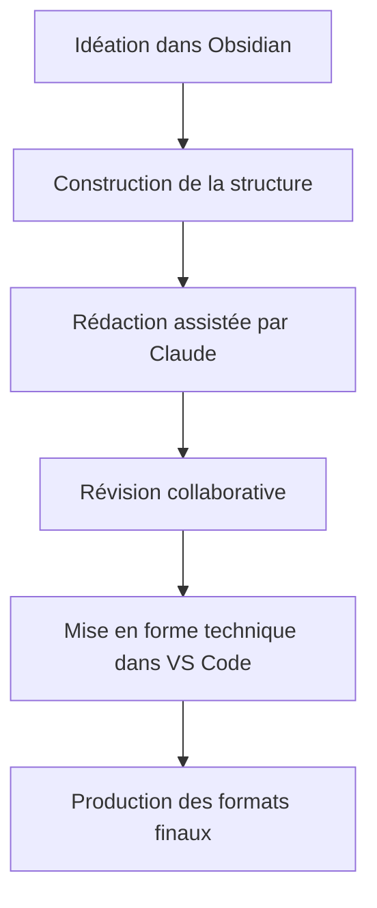

# PROJECT KNOWLEDGE: GUIDE COMPLET
## Édition littéraire assistée par Claude avec Obsidian & VS Code

---

## Table des matières
- [DIRECTIVE D'UTILISATION](#directive-dutilisation)
  - [Système de navigation par liens](#système-de-navigation-par-liens)
- [1. VUE D'ENSEMBLE DU WORKFLOW](#1-vue-densemble-du-workflow)
  - [Avantages clés de ce workflow](#avantages-clés-de-ce-workflow)
- [2. PRÉPARATION DE L'ENVIRONNEMENT](#2-préparation-de-lenvironnement)
  - [Installation des outils](#installation-des-outils)
  - [Configuration du dépôt Git](#configuration-du-dépôt-git)
- [3. STRUCTURE DU PROJECT KNOWLEDGE](#3-structure-du-project-knowledge)
  - [Organisation des fichiers](#organisation-des-fichiers)
  - [Document index](#document-index)
- [4. UTILISATION DE CLAUDE](#4-utilisation-de-claude)
  - [Organisation en projets Claude](#organisation-en-projets-claude)
  - [Importation de documents GitHub](#importation-de-documents-github)
  - [Initialisation du projet](#initialisation-du-projet)
  - [Sessions de brainstorming](#sessions-de-brainstorming)
  - [Gestion des limitations de session](#gestion-des-limitations-de-session)
  - [Révision de contenu](#révision-de-contenu)
  - [Stockage des interactions](#stockage-des-interactions)
- [5. WORKFLOW OBSIDIAN](#5-workflow-obsidian)
  - [Création de la structure](#création-de-la-structure)
  - [Gestion des personnages et éléments](#gestion-des-personnages-et-éléments)
  - [Navigation par graphe](#navigation-par-graphe)
- [6. INTÉGRATION VS CODE](#6-intégration-vs-code)
  - [Configuration optimale](#configuration-optimale)
  - [Scripts d'automatisation](#scripts-dautomatisation)
  - [Options multiplateforme](#options-multiplateforme)
- [6.1 GESTION DE LA TYPOGRAPHIE](#61-gestion-de-la-typographie)
  - [Typographie française avancée](#typographie-française-avancée)
  - [Outils de vérification typographique](#outils-de-vérification-typographique)
  - [Interface utilisateur pour la correction](#interface-utilisateur-pour-la-correction)
  - [Standards spécifiques par genre](#standards-spécifiques-par-genre)
- [7. GÉNÉRATION DES FORMATS FINAUX](#7-génération-des-formats-finaux)
  - [HTML et site web](#html-et-site-web)
  - [PDF de qualité édition](#pdf-de-qualité-édition)
  - [Format EPUB](#format-epub)
- [8. BONNES PRATIQUES](#8-bonnes-pratiques)
  - [Versionnement](#versionnement)
  - [Sauvegarde](#sauvegarde)
  - [Collaboration](#collaboration)
- [9. RESSOURCES COMPLÉMENTAIRES](#9-ressources-complémentaires)
  - [Tutoriels recommandés](#tutoriels-recommandés)
  - [Extensions et plugins utiles](#extensions-et-plugins-utiles)
  - [Bonnes pratiques avec Claude](#bonnes-pratiques-avec-claude)
- [FIN DU GUIDE](#fin-du-guide)

---

## DIRECTIVE D'UTILISATION

Ce guide documente un workflow d'édition littéraire assisté par IA combinant Claude, Obsidian et VS Code. Il est conçu pour les auteurs et éditeurs habitués aux outils traditionnels (Word, etc.) souhaitant adopter un environnement de travail plus puissant.

### Système de navigation par liens

Ce document utilise deux types de liens Markdown standard qui fonctionnent parfaitement à la fois dans GitHub et dans Obsidian :

1. **Liens d'ancrage** pour naviguer à l'intérieur du document :
   ```markdown
   [Nom de la section](#nom-de-la-section)
   ```

2. **Liens relatifs** pour naviguer entre documents :
   ```markdown
   [Nom du Concept](dossier/fichier.md)
   ```

Cette approche permet une navigation fluide entre et à l'intérieur des documents dans les deux environnements.

**Types de références (utilisés comme tags):**
* Workflow - Étapes du processus d'édition
* Outil - Logiciels et interfaces
* Technique - Méthodes spécifiques d'édition
* Structure - Éléments d'organisation du contenu
* Format - Types de fichiers et formats de sortie
* Pratique - Bonnes pratiques recommandées
* IA - Utilisation spécifique de Claude
* Référence - Ressources supplémentaires

---

## 1. VUE D'ENSEMBLE DU WORKFLOW

Notre workflow d'édition littéraire combine trois outils principaux:

1. **Claude** [Claude](outil/ia01-claude.md) #Outil #IA - Assistant IA pour la révision, l'amélioration et la génération de contenu
2. **Obsidian** [Obsidian](outil/ed01-obsidian.md) #Outil - Pour l'idéation, l'organisation conceptuelle et la structure
3. **VS Code** [VSCode](outil/ed02-vscode.md) #Outil - Pour le travail technique et les intégrations

Le flux de travail se décompose en 6 phases principales:



### Avantages clés de ce workflow
- Organisation non-linéaire des idées
- Versionnement robuste avec Git
- Assistance IA personnalisée
- Séparation contenu/mise en forme
- Génération automatisée de multiples formats de sortie

---

## 2. PRÉPARATION DE L'ENVIRONNEMENT

### Installation des outils [Installation](workflow/prep01-installation.md) #Workflow

1. **Claude**
   - Accédez à [claude.ai](https://claude.ai)
   - Créez un compte si nécessaire

2. **Obsidian**
   - Téléchargez depuis [obsidian.md](https://obsidian.md)
   - Installez les plugins recommandés:
     * Outliner
     * Kanban
     * Templates
     * Tag Pane
     * Obsidian Git

3. **VS Code**
   - Téléchargez depuis [code.visualstudio.com](https://code.visualstudio.com)
   - Installez les extensions recommandées:
     * Markdown All in One
     * Markdown Preview Enhanced
     * GitLens
     * Paste Image

### Configuration du dépôt Git [GitSetup](workflow/prep02-gitsetup.md) #Workflow

1. Créez un nouveau dépôt Git local:
   ```bash
   mkdir mon-projet-litteraire
   cd mon-projet-litteraire
   git init
   ```

2. Configurez Obsidian pour utiliser ce dossier comme coffre (vault)

3. Installez et configurez le plugin Obsidian Git:
   - Intervalle de sauvegarde: 10 minutes
   - Messages de commit automatiques

---

## 3. STRUCTURE DU PROJECT KNOWLEDGE

### Organisation des fichiers [Structure](structure/org01-structure.md) #Structure

```
mon-projet-litteraire/
├── index.md                # Document principal
├── structure/              # Plan et structure 
├── chapitres/              # Contenu principal
├── ressources/             # Recherches et références
├── media/                  # Images et autres médias
├── templates/              # Modèles de documents
└── export/                 # Fichiers générés
```

### Document index [IndexDoc](structure/org02-indexdoc.md) #Structure

Le fichier `index.md` sert de point d'entrée et contient:
- Métadonnées du projet
- Liens vers les sections principales
- État d'avancement
- Notes éditoriales générales

Exemple:
```markdown
# Mon Projet Littéraire

## Métadonnées
- Titre: [Titre de l'œuvre]
- Auteur: [Votre nom]
- Genre: [Genre littéraire]
- Statut: #en-cours

## Structure
- [Plan général](structure/plan-general.md)
- [Personnages](structure/personnages.md)
- [Univers](structure/univers.md)

## Chapitres
- [Chapitre 1](chapitres/chapitre-01.md)
- [Chapitre 2](chapitres/chapitre-02.md)
...
```

---

## 4. UTILISATION DE CLAUDE

### Organisation en projets Claude [ProjetsClaude](ia/claude00-projets-claude.md) #IA

Structurez votre travail efficacement sur Claude:

1. Créez des projets distincts pour:
   - Développement narratif global
   - Travail sur les personnages
   - Révision stylistique
   - Recherche thématique

2. Avantages de l'organisation en projets:
   - Contexte préservé entre les sessions
   - Historique des conversations accessible
   - Séparation claire des différentes dimensions du travail
   - Facilite le partage avec des collaborateurs

3. Nommez clairement vos projets pour faciliter la navigation:
   ```
   [Titre du livre] - Développement narratif
   [Titre du livre] - Personnages
   [Titre du livre] - Révision
   ```

### Importation de documents GitHub [ImportGitHub](ia/claude01-import-github.md) #IA

Claude peut importer directement des documents depuis GitHub:

1. Avantages:
   - Partage de documents volumineux
   - Conservation de la mise en forme
   - Travail sur des versions spécifiques
   - Analyse de sections entières

2. Comment importer:
   - Utilisez la fonction d'upload de document dans l'interface Claude
   - Partagez des liens directs vers les fichiers raw de GitHub
   - Demandez à Claude d'analyser des sections spécifiques

3. Bonnes pratiques:
   - Fragmentez les documents volumineux en sections logiques
   - Utilisez des commentaires dans les fichiers pour guider Claude
   - Référez-vous à des lignes ou sections spécifiques dans vos prompts

### Initialisation du projet [InitProjet](ia/claude02-init-projet.md) #IA

Pour initialiser Claude avec votre projet:

1. Créez une session de chat dédiée
2. Présentez le concept général et le genre littéraire
3. Définissez le ton et le style souhaités
4. Établissez une terminologie spécifique 

Exemple de prompt initial:
```
Je travaille sur un roman [genre] intitulé "[titre]". 
Le concept central est [concept]. 
Les personnages principaux sont [personnages].
J'aimerais que tu m'aides avec le développement de l'intrigue, 
la cohérence des personnages et le style d'écriture, 
qui devrait être [caractéristiques du style].
```

### Sessions de brainstorming [Brainstorming](ia/claude03-brainstorming.md) #IA

Utilisez Claude pour explorer de nouvelles idées:

1. Décrivez un élément spécifique (personnage, scène, concept)
2. Demandez des variations ou développements
3. Enregistrez les idées pertinentes dans Obsidian

Exemple:
```
Peux-tu m'aider à développer le personnage de [nom]?
Voici ce que j'ai déjà: [description existante].
J'aimerais explorer ses motivations et son arc narratif.
```

### Gestion des limitations de session [LimiteSessions](ia/claude04-limite-sessions.md) #IA

Optimisez l'utilisation de Claude malgré les limitations:

1. **Contraintes actuelles**:
   - Limite de taille par message
   - Limite d'échanges par période
   - Historique limité par conversation

2. **Stratégies d'optimisation**:
   - Divisez les longs textes en segments thématiques
   - Utilisez des liens GitHub pour partager de longs documents
   - Résumez les conversations précédentes dans les nouveaux prompts
   - Exportez régulièrement les conversations importantes

3. **Préparation du contexte**:
   - Créez des résumés à jour de votre projet
   - Préparez des "fiches contextuelles" réutilisables
   - Indiquez clairement où vous en étiez lors de la dernière session

### Révision de contenu [Revision](ia/claude05-revision.md) #IA

Pour soumettre du contenu à révision:

1. Copiez le texte depuis Obsidian ou importez depuis GitHub
2. Spécifiez clairement vos demandes de révision
3. Intégrez les suggestions pertinentes dans votre document

Exemple:
```
Voici un extrait du chapitre 3:

[Votre texte]

J'aimerais que tu:
1. Améliores la fluidité des dialogues
2. Vérifies la cohérence avec les événements du chapitre 2
3. Renforces la caractérisation du personnage principal
```

### Stockage des interactions [SessionsLog](ia/claude06-sessions-log.md) #IA

Documenter vos sessions avec Claude:

1. Créez un dossier `claude-sessions/` dans votre projet
2. Pour chaque session importante, créez un fichier Markdown
3. Incluez le contexte, les prompts et les réponses clés

---

## 5. WORKFLOW OBSIDIAN

### Création de la structure [StructureCreation](workflow/obs01-structure-creation.md) #Workflow

Utilisez Obsidian pour établir la structure principale:

1. Créez un fichier `structure/plan-general.md`
2. Utilisez des titres et sous-titres pour établir la hiérarchie
3. Créez des liens vers des fichiers détaillés pour chaque section

### Gestion des personnages et éléments [ElementsGestion](workflow/obs02-elements-gestion.md) #Workflow

Créez des fiches détaillées:

1. Un fichier par personnage/élément important
2. Utilisez des templates standardisés
3. Créez des liens bidirectionnels entre éléments connexes

Exemple de template personnage:
```markdown
# {{nom}}

## Caractéristiques
- Âge:
- Apparence:
- Traits de caractère:

## Contexte
- Origine:
- Famille:
- Occupation:

## Arc narratif
- Motivation:
- Conflit:
- Évolution:

## Apparitions
- [Chapitre où le personnage apparaît](chapitres/chapitre-exemple.md)

## Notes
```

### Navigation par graphe [GraphView](technique/obs03-graph-view.md) #Technique

Exploitez la vue graphique d'Obsidian:

1. Activez la vue graphe (icône de nœuds dans la barre latérale)
2. Filtrez par tags pour visualiser des aspects spécifiques
3. Identifiez les connexions non évidentes entre éléments

---

## 6. INTÉGRATION VS CODE

### Configuration optimale [VSCodeSetup](outil/vsc01-vscode-setup.md) #Outil

Configurez VS Code pour le travail d'édition littéraire:

```json
{
  "markdown.extension.toc.updateOnSave": true,
  "markdown.extension.preview.autoShowPreviewToSide": true,
  "editor.wordWrap": "on",
  "editor.lineHeight": 24
}
```

### Scripts d'automatisation [Scripts](technique/vsc02-scripts.md) #Technique

Développez des scripts Python pour automatiser certaines tâches:

1. Création d'un script d'assemblage:
```python
# compile.py
# Script qui assemble tous les fichiers Markdown selon la structure
import os
import re

def compile_document(index_file, output_file):
    # Logique d'assemblage
    pass
```

2. Script d'extraction pour Claude:
```python
# extract_for_claude.py
# Extrait une section pour révision avec Claude
import sys

def extract_section(file_path, section_name):
    # Logique d'extraction
    pass
```

### Options multiplateforme [Multiplateforme](technique/vsc03-multiplateforme.md) #Technique

Pour accommoder les utilisateurs de différents environnements:

1. **Interface graphique simple**:
   - Créez un script Python avec interface Tkinter:
   ```python
   import tkinter as tk
   from tkinter import filedialog
   
   def create_simple_gui():
       root = tk.Tk()
       root.title("Outils d'édition")
       # Ajoutez des boutons pour les fonctions courantes
       # Exemple: assembler, vérifier, exporter
   ```

2. **Utilisateurs Windows (CMD)**:
   - Créez des fichiers batch (.bat) équivalents:
   ```batch
   @echo off
   REM compile.bat
   python compile.py %1 %2
   ```

3. **Interface web GitHub**:
   - Ajoutez des Actions GitHub dans `.github/workflows/`:
   ```yaml
   name: Compiler Document
   on: [push]
   jobs:
     build:
       runs-on: ubuntu-latest
       steps:
         - uses: actions/checkout@v2
         - name: Set up Python
           uses: actions/setup-python@v2
         - name: Compiler
           run: python compile.py
   ```

---

## 6.1 GESTION DE LA TYPOGRAPHIE [Typographie](workflow/typ01-typographie.md) #Workflow

### Typographie française avancée [TypoFR](technique/typ02-typo-fr.md) #Technique

La typographie française comporte des règles spécifiques à respecter:

1. **Espaces insécables**:
   - Avant les signes doubles (:, ?, !, ;)
   - Après l'ouverture et avant la fermeture des guillemets français (« »)
   - Dans les nombres pour séparer les milliers

2. **Guillemets**:
   - Utilisation des guillemets français (« ») pour les citations principales
   - Guillemets anglais (" ") pour les citations à l'intérieur d'autres citations

3. **Tirets**:
   - Tiret cadratin (—) pour les dialogues
   - Tiret demi-cadratin (–) pour les incises

### Outils de vérification typographique [OutilsTypo](technique/typ03-outils-typo.md) #Technique

1. **Grammarleck** (Python):
   ```python
   # typo_check.py
   import grammalecte
   
   def check_typography(text_file):
       with open(text_file, 'r', encoding='utf-8') as f:
           text = f.read()
       
       gc = grammalecte.GrammarChecker("fr")
       result = gc.correct(text)
       
       return result
   ```

2. **Adaptation aux standards d'édition**:
   Créez un fichier de configuration pour respecter le style d'une maison d'édition:
   ```json
   {
     "typographie": {
       "guillemets": "français",
       "dialogues": "cadratin",
       "citation_imbriquée": "anglais",
       "espaces_insécables": true
     }
   }
   ```

3. **Script de correction automatique**:
   ```python
   # auto_typography.py
   import re
   
   def fix_french_typography(text):
       # Remplace les guillemets droits par des guillemets français
       text = re.sub(r'"([^"]*)"', r'« \1 »', text)
       
       # Ajoute des espaces insécables
       text = re.sub(r'([?!:;])', r' \1', text)
       
       # Corrige les dialogues
       text = re.sub(r'- ', r'— ', text)
       
       return text
   ```

### Interface utilisateur pour la correction [InterfaceTypo](technique/typ04-interface-typo.md) #Technique

Pour les utilisateurs moins techniques:

1. **Extension VS Code**:
   - Créez une extension simple avec des boutons pour appliquer les règles
   - Ajoutez une prévisualisation en temps réel des corrections

2. **Interface web simple**:
   - Formulaire HTML permettant de coller du texte et d'obtenir une version corrigée
   - Déployable sur GitHub Pages

3. **Intégration avec Obsidian**:
   - Créez un plugin personnalisé
   - Ajoutez des commandes accessibles dans la palette d'Obsidian

### Standards spécifiques par genre [GenreTypo](technique/typ05-genre-typo.md) #Technique

Configurez des préréglages pour différents genres littéraires:

1. **Roman littéraire**:
   - Guillemets français
   - Dialogues avec tiret cadratin et retour à la ligne

2. **Poésie**:
   - Préservation des espaces en début de ligne
   - Traitement spécial des enjambements

3. **Documentation technique**:
   - Format de référence ISO
   - Espacement spécifique pour les listes

4. **Livres académiques**:
   - Format de citation standardisé (APA, MLA, Chicago)
   - Gestion des notes de bas de page

---

## 7. GÉNÉRATION DES FORMATS FINAUX [Export](workflow/exp01-export.md) #Workflow

Utilisez VS Code pour générer les formats de sortie:

### HTML et site web

1. Installez l'extension "Markdown PDF" dans VS Code
2. Configurez les options d'export HTML
3. Exportez chaque chapitre ou le document assemblé

### PDF de qualité édition

1. Utilisez Pandoc via terminal:
```bash
pandoc -s document.md -o document.pdf --pdf-engine=xelatex --template=template.tex
```

2. Personnalisez les styles avec un fichier template.tex

### Format EPUB

1. Utilisez Pandoc pour générer l'EPUB:
```bash
pandoc -s document.md -o document.epub --epub-cover-image=cover.jpg
```

2. Validez le format avec EpubCheck

---

## 8. BONNES PRATIQUES

### Versionnement [Versionnement](pratique/git01-versionnement.md) #Pratique

1. Committez fréquemment avec des messages descriptifs
2. Créez des branches pour les révisions majeures
3. Utilisez des tags Git pour marquer les versions importantes:
```bash
git tag -a v0.1 -m "Premier jet complet"
```

### Sauvegarde [Sauvegarde](pratique/sec01-sauvegarde.md) #Pratique

1. Configurez un dépôt Git distant (GitHub, GitLab)
2. Poussez régulièrement vos modifications
3. Envisagez des sauvegardes supplémentaires hors Git

### Collaboration [Collaboration](pratique/collab01-collaboration.md) #Pratique

Pour travailler à plusieurs:

1. Établissez des conventions de nommage claires
2. Assignez des sections distinctes à chaque collaborateur
3. Utilisez des Pull Requests pour les fusions importantes
4. Planifiez des sessions de révision communes

---

## 9. RESSOURCES COMPLÉMENTAIRES

### Tutoriels recommandés [Tutoriels](reference/tut01-tutoriels.md) #Référence
- [Guide officiel Obsidian](https://help.obsidian.md)
- [Markdown Guide](https://www.markdownguide.org)
- [Utilisation avancée de Git](https://git-scm.com/book)

### Extensions et plugins utiles [Extensions](reference/ext01-extensions.md) #Référence
- Obsidian: Dataview, Admonition
- VS Code: Code Spell Checker, Word Count

### Bonnes pratiques avec Claude [ClaudeBestPractices](ia/claude07-best-practices.md) #IA

#### Nomenclature correcte
1. **Utilisation du nom**: L'assistant s'appelle simplement "Claude" et non "Claude.ai". Le ".ai" fait référence au domaine du site web (claude.ai), mais n'est pas inclus dans le nom du produit.

2. **Références cohérentes**: Utilisez toujours "Claude" de manière cohérente dans tous vos documents et communications pour éviter la confusion.

#### Utilisation des liens dans les documents
1. **Liens relatifs uniquement**: Évitez d'inclure des liens absolus vers des conversations Claude dans vos documents destinés à être partagés. Ces liens ne fonctionneront pas pour les autres utilisateurs.
   ```markdown
   # À éviter
   [Conversation Claude](https://claude.ai/chat/f9fb33fd-e95d-4a5f-838c-ccc1c60df751)
   
   # Préférez cette approche
   [Importation GitHub](ia/claude01-import-github.md) #IA
   ```

2. **Liens pour les développeurs du guide**: Si vous développez ce guide et souhaitez référencer des conversations Claude, utilisez un fichier séparé de notes développeur ou incluez ces liens sous forme de commentaires.

3. **Partage de conversations**: Pour partager une conversation Claude spécifique avec un collaborateur, utilisez la fonction d'exportation de Claude ou créez un résumé dans un fichier de votre projet.

#### Meilleures pratiques pour la communication avec Claude
1. **Instructions claires et précises**: Formulez vos demandes avec précision pour obtenir les meilleurs résultats.
   ```
   # Moins efficace
   "Améliore mon texte"
   
   # Plus efficace
   "Améliore la clarté et la concision de ce paragraphe en préservant les informations clés sur les personnages"
   ```

2. **Contexte suffisant**: Fournissez toujours assez de contexte pour que Claude comprenne votre projet.
   ```
   # Fournir du contexte
   "Ce texte fait partie d'un roman historique se déroulant en France au 18e siècle. Le personnage principal vient de découvrir..."
   ```

3. **Feedback itératif**: Engagez un dialogue avec Claude en affinant progressivement les résultats par des retours précis.

4. **Organisation des documents**: Structurez vos documents avec des en-têtes clairs et une hiérarchie logique pour faciliter l'analyse par Claude.

#### Organisation des références pour Claude
1. Pour que Claude puisse naviguer efficacement dans votre document:
   - Utilisez des identifiants de section clairs et uniques
   - Structurez vos tags de manière cohérente
   - Incluez des titres explicites pour chaque section

2. Lors du téléchargement vers Claude, assurez-vous que votre document maintient sa structure et sa mise en forme pour faciliter l'analyse.

#### Gestion des limitations techniques
1. **Taille des messages**: Divisez les longs textes en segments thématiques de taille raisonnable.
   
2. **Continuité des sessions**: Pour maintenir le contexte entre les sessions:
   - Résumez les points clés des conversations précédentes
   - Utilisez des références explicites aux discussions antérieures
   - Conservez un document d'état pour suivre la progression du projet

---

## FIN DU GUIDE
Ce document est évolutif. Référez-vous à la version la plus récente sur le dépôt Git.

Version: 1.0 | Dernière mise à jour: 15 mars 2025