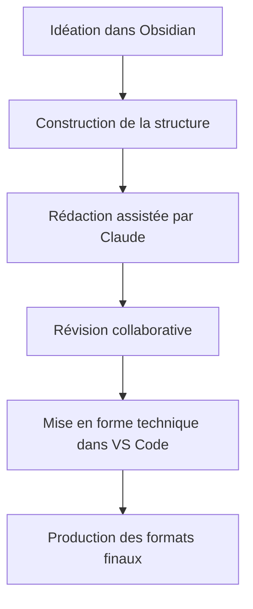

# PROJECT KNOWLEDGE: GUIDE COMPLET
## Édition littéraire assistée par Claude avec Obsidian & VS Code

---

## Table des matières
- [DIRECTIVE D'UTILISATION](#directive-dutilisation)
  - [Système de navigation par liens](#système-de-navigation-par-liens)
- [1. VUE D'ENSEMBLE DU WORKFLOW](#1-vue-densemble-du-workflow)
  - [Avantages clés de ce workflow](#avantages-clés-de-ce-workflow)
- [2. PRÉPARATION DE L'ENVIRONNEMENT](#2-préparation-de-lenvironnement)
  - [Installation des outils](#installation-des-outils)
  - [Configuration du dépôt Git](#configuration-du-dépôt-git)
- [3. STRUCTURE DU PROJECT KNOWLEDGE](#3-structure-du-project-knowledge)
  - [Organisation des fichiers](#organisation-des-fichiers)
  - [Document index](#document-index)
- [4. UTILISATION DE CLAUDE](#4-utilisation-de-claude)
  - [Organisation en projets Claude](#organisation-en-projets-claude)
  - [Importation de documents GitHub](#importation-de-documents-github)
  - [Initialisation du projet](#initialisation-du-projet)
  - [Sessions de brainstorming](#sessions-de-brainstorming)
  - [Gestion des limitations de session](#gestion-des-limitations-de-session)
  - [Révision de contenu](#révision-de-contenu)
  - [Stockage des interactions](#stockage-des-interactions)
- [5. WORKFLOW OBSIDIAN](#5-workflow-obsidian)
  - [Création de la structure](#création-de-la-structure)
  - [Gestion des personnages et éléments](#gestion-des-personnages-et-éléments)
  - [Navigation par graphe](#navigation-par-graphe)
- [6. INTÉGRATION VS CODE](#6-intégration-vs-code)
  - [Configuration optimale](#configuration-optimale)
  - [Scripts d'automatisation](#scripts-dautomatisation)
  - [Options multiplateforme](#options-multiplateforme)
- [6.1 GESTION DE LA TYPOGRAPHIE](#61-gestion-de-la-typographie)
  - [Typographie française avancée](#typographie-française-avancée)
  - [Outils de vérification typographique](#outils-de-vérification-typographique)
  - [Interface utilisateur pour la correction](#interface-utilisateur-pour-la-correction)
  - [Standards spécifiques par genre](#standards-spécifiques-par-genre)
- [7. GÉNÉRATION DES FORMATS FINAUX](#7-génération-des-formats-finaux)
  - [HTML et site web](#html-et-site-web)
  - [PDF de qualité édition](#pdf-de-qualité-édition)
  - [Format EPUB](#format-epub)
- [8. BONNES PRATIQUES](#8-bonnes-pratiques)
  - [Versionnement](#versionnement)
  - [Sauvegarde](#sauvegarde)
  - [Collaboration](#collaboration)
- [9. RESSOURCES COMPLÉMENTAIRES](#9-ressources-complémentaires)
  - [Tutoriels recommandés](#tutoriels-recommandés)
  - [Extensions et plugins utiles](#extensions-et-plugins-utiles)
  - [Bonnes pratiques avec Claude](#bonnes-pratiques-avec-claude)
- [FIN DU GUIDE](#fin-du-guide)

---

## DIRECTIVE D'UTILISATION

Ce guide documente un workflow d'édition littéraire assisté par IA combinant Claude, Obsidian et VS Code. Il est conçu pour les auteurs et éditeurs habitués aux outils traditionnels (Word, etc.) souhaitant adopter un environnement de travail plus puissant.

### Système de navigation par liens

Ce document utilise des liens Markdown standard qui fonctionnent parfaitement à la fois dans GitHub et dans Obsidian :

```markdown
[Nom du Concept](dossier/identifiant-concept.md)
```

Cette approche permet une navigation fluide entre les documents dans les deux environnements.

**Types de références (utilisés comme tags):**
* Workflow - Étapes du processus d'édition
* Outil - Logiciels et interfaces
* Technique - Méthodes spécifiques d'édition
* Structure - Éléments d'organisation du contenu
* Format - Types de fichiers et formats de sortie
* Pratique - Bonnes pratiques recommandées
* IA - Utilisation spécifique de Claude
* Référence - Ressources supplémentaires

---

## 1. VUE D'ENSEMBLE DU WORKFLOW

Notre workflow d'édition littéraire combine trois outils principaux:

1. **Claude** [Claude](outil/ia01-claude.md) #Outil #IA - Assistant IA pour la révision, l'amélioration et la génération de contenu
2. **Obsidian** [Obsidian](outil/ed01-obsidian.md) #Outil - Pour l'idéation, l'organisation conceptuelle et la structure
3. **VS Code** [VSCode](outil/ed02-vscode.md) #Outil - Pour le travail technique et les intégrations

Le flux de travail se décompose en 6 phases principales:



### Avantages clés de ce workflow
- Organisation non-linéaire des idées
- Versionnement robuste avec Git
- Assistance IA personnalisée
- Séparation contenu/mise en forme
- Génération automatisée de multiples formats de sortie

---

## 2. PRÉPARATION DE L'ENVIRONNEMENT

### Installation des outils [Installation](workflow/prep01-installation.md) #Workflow

1. **Claude**
   - Accédez à [claude.ai](https://claude.ai)
   - Créez un compte si nécessaire

2. **Obsidian**
   - Téléchargez depuis [obsidian.md](https://obsidian.md)
   - Installez les plugins recommandés:
     * Outliner
     * Kanban
     * Templates
     * Tag Pane
     * Obsidian Git

3. **VS Code**
   - Téléchargez depuis [code.visual