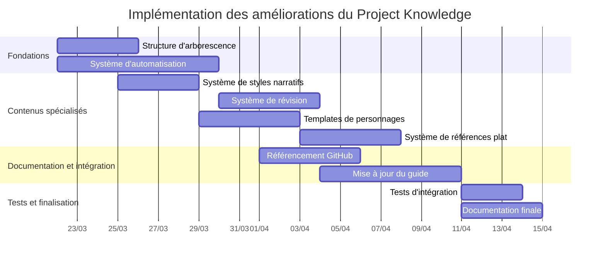

# Implémentation des améliorations du Project Knowledge

**Période**: 2025-03-22 → 2025-04-10

## Diagramme de Gantt

## Liste des tâches

| ID | Tâche | Dates | Intervenants |
|---|---|---|---|
| TODO-STRCT | Mise à jour de la structure d'arborescence | 2025-03-22 → 2025-03-25 | [[dev-principal]], [[architecte-contenu]] |
| TODO-AUTO | Développement du système d'automatisation | 2025-03-22 → 2025-03-29 | [[dev-principal]], [[specialiste-integration]] |
| TODO-STYLE | Intégration du système de styles narratifs | 2025-03-25 → 2025-03-28 | [[redacteur-principal]], [[expert-styles]] |
| TODO-REVW | Intégration du système de révision | 2025-03-30 → 2025-04-03 | [[dev-principal]], [[redacteur-principal]] |
| TODO-CHAR | Amélioration des templates de personnages | 2025-03-29 → 2025-04-02 | [[redacteur-principal]], [[specialiste-personnages]] |
| TODO-FLAT | Implémentation du système de références plat | 2025-04-03 → 2025-04-07 | [[architecte-contenu]], [[specialiste-references]] |
| TODO-REFS | Système de référencement GitHub | 2025-04-01 → 2025-04-05 | [[specialiste-github]], [[dev-principal]] |
| TODO-GUIDE | Mise à jour du guide-complet.md | 2025-04-04 → 2025-04-10 | [[redacteur-principal]], [[architecte-contenu]] |

## Notes de planification

Le plan d'implémentation suit une approche progressive en commençant par les fondations (structure et automatisation) avant de passer aux contenus spécialisés. La mise à jour du guide principal est planifiée vers la fin pour intégrer les résultats des autres tâches.

Les tâches de tests et de documentation finale ne sont pas détaillées dans la liste mais sont incluses dans le diagramme pour donner une vision complète du projet. Certaines tâches peuvent être réalisées en parallèle (comme indiqué dans le diagramme) pour optimiser le temps de développement.
