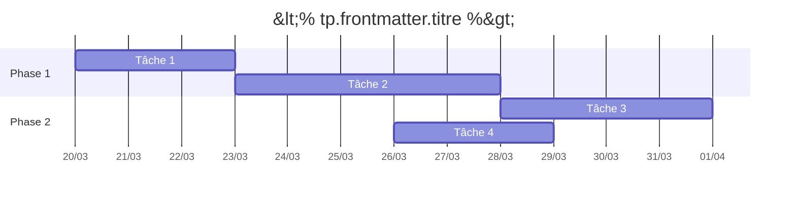

# <% tp.frontmatter.titre %>

**Période**: <% tp.frontmatter.date_debut %> → <% tp.frontmatter.date_fin %>

## Diagramme de Gantt

## Liste des tâches

| ID | Tâche | Dates | Intervenants |
|---|---|---|---|
| TODO-AAAAA | Tâche 1 | 2025-03-20 → 2025-03-23 | [[nom-intervenant]] |
| TODO-BBBBB | Tâche 2 | 2025-03-23 → 2025-03-28 | [[nom-intervenant]] |
| TODO-CCCCC | Tâche 3 | 2025-03-28 → 2025-04-01 | [[nom-intervenant]] |
| TODO-DDDDD | Tâche 4 | 2025-03-26 → 2025-03-29 | [[nom-intervenant]] |

## Notes de planification

